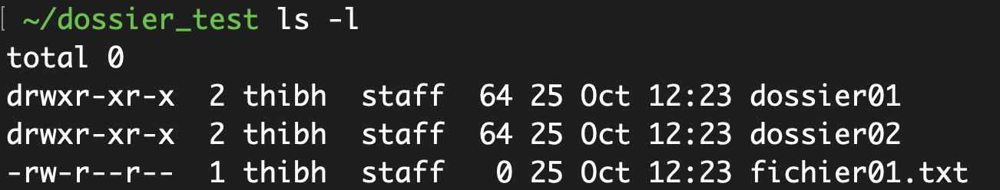
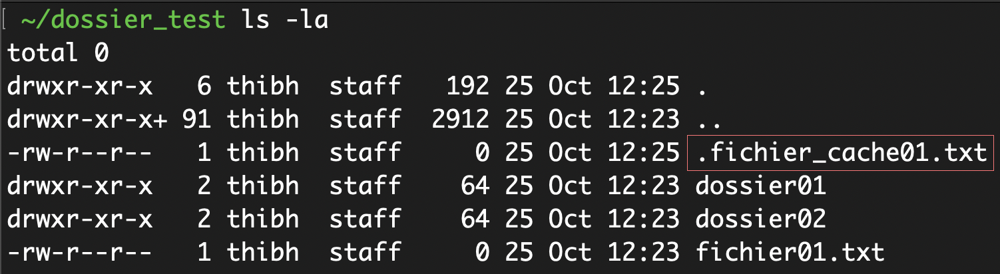

# Les commandes du Terminal

Il existe des centaines de commandes bash différentes que vous pouvez utiliser à l'intérieur de votre Terminal. Voici 6 commandes couramment utilisées pour naviguer dans votre système d'exploitation et créer des fichiers et dossiers :

### La commande ls

Cette commande permet de **l**i**s**ter les fichiers et dossiers qui se trouvent dans le répertoire courant :

Pour une vue en liste, vous pouvez utiliser le flag `-l`

Pour afficher les fichiers et dossiers cachés, vous pouvez également ajouter le flag `-a`

### La commande cd

Cette commande permet de naviguer à l'intérieur de la structure de dossier de votre système d'exploitation. Pour cela, il suffit de suivre cette commande du nom du dossier dans lequel vous souhaitez naviguer. Par exemple, pour entrer à l'intérieur du dossier `dossier_test` :

Pour remonter dans le dossier parent, vous pouvez utiliser la notation `..` qui représente le dossier parent du dossier dans lequel vous vous trouvez :

### La commande pwd

Cette commande permet tout simplement d'afficher le chemin du dossier courant. Pas grand chose de plus à dire :

### La commande clear

Cette commande permet d'effacer les commandes précédemment exécutées dans le terminal. Pratique pour faire du ménage et y voir un peu plus clair 🤓

### La commande mkdir

Cette commande permet de créer un dossier à l'intérieur du dossier courant. Il suffit de suivre cette commande du nom du dossier que vous souhaitez créer. Si vous êtes dans un endroit sur votre ordinateur qui nécessite des droits d'administrateurs, il se peut que vous ayez besoin de précéder cette commande de `sudo` afin de l'exécuter avec des droits élevés (votre mot de passe administrateur vous sera demandé).

### La commande touch

Cette commande permet, elle, de créer un fichier ! N'oubliez pas d'indiquer l'extension du fichier que vous souhaitez créer, bash ne la devinera pas tout seul !

### La commande rm

Pour finir, cette commande permet tout simplement de supprimer un fichier ou un dossier. ⚠️ Pour supprimer un dossier, vous devez ajouter le flag `-r` :

